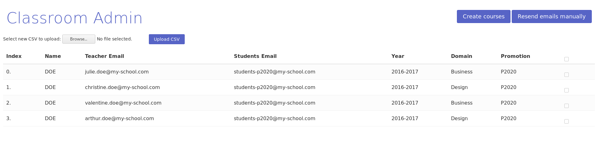

# Classroom Admin

This application enables to create Google Classrooms in bulk from a CSV file when you are using the Google Apps suite for your organization.

The problem encountered by the Web School Factory Staff was that they had to create
each Google Classroom and add each student to it manually. They had to do it every year for each class. This is quite a repetitive task.

So, we developed Classroom Admin which allows the staff of a school to create all classrooms and affect to them students all in one stretch.

In order to use the software, the Staff has to prepare CSV (or Excel) files with the list of all courses
with for each of them the email of the teacher and the mailing list of the students.
Then, they only need to upload it into the Classroom Admin interface and click on the "Create courses" button. And voilà! Each Google Classroom will be created with students automatically added to it and the teachers will receive an email with all the information they need to manage their classroom.

In case some teacher tells you something like *"Where is my Google Classroom? I don't know where I have to put my classroom materials!"*, there is also a feature which allows you to resend the email with all the information for given courses. You just need to upload the right CSV file, select the courses for which you want to resend and click on "Resend manually emails".

This feature has also been added for technical reasons because Gmail can't guarantee that all emails are sent accordingly and you may need to resend the emails in case Gmail has not been able to process everything.



## Installation

### Requirements

Software Requirements:
  - Docker 1.11.2
  - Docker Compose 1.7.1

To install these on Ubuntu 16.04 follow [this tutorial](https://www.digitalocean.com/community/tutorials/how-to-install-and-use-docker-on-ubuntu-16-04) and execute [these two command-lines](https://github.com/docker/compose/releases/tag/1.7.1)

API Requirements:
  - Admin SDK API enabled
  - Gmail API enabled
  - Google Classroom API enabled
  - Client ID for Web Server

### Google's admin account creation

To get your client ID, go on [Google's Console API](https://console.developers.google.com/apis/).

1. Create a Project with the name of your choice
2. Create keys for your project
  1. Choose Web Application keys
  2. Download the client ID and the client secret JSON file given by Google and
  rename it to `client_secret.json`
  3. Authorize the domain name where you want to host the app
3. Enable the three following APIs for the project:
  1. Admin SDK API
  2. Gmail API
  3. Google Classroom API

### Application setup

Once the requirements installed, simply clone this directory on your server,
add your Google API secret and launch docker-compose:

1. Clone the repository:
``` Server
git clone https://github.com/KillianKemps/ClassroomAdmin
```

2. Copy your Google client ID from your computer to the server under the name `client_secret.json`
``` Computer
scp client_secret.json username@your-server-address:~/ClassroomAdmin
```

3. Configure you app as described [below](#Configuration)

4. Launch the app in background
```
cd ClassroomAdmin
docker-compose up -d
```

The app is then accessible either at `http://localhost` or at the hostname

## Configuration

Some setup is needed to allow you to create courses and to send emails according to your taste. This configuration allows you to choose values of your CSV file and to format some fields.

Two configuration files templates are available in `conf/`. Simply copy and rename them without `.template` to enable them.

Please see below for details about the configuration values:

### Course

Choose here the values needed among you CSV column names to create a classroom course.

```
ownerId: Owner's email or ID
name: Course name
section-format: Section template
section-values: Values for section template
teacher: Teacher email or ID
member-email-domain: Email domain of only students
```

### Email

Choose here the values to access in your CSV file and in the `course` object returned by the Google API: https://developers.google.com/classroom/reference/rest/v1/courses#Course

**Warning: You should not name your CSV columns with the same name as the keys of the `course` object. It will be overriden.**


```
to: Email to send to
subject-format: Subject template
subject-value: Value to use in subject template
content-value: Values to be used in content template
content-format: Content template
```

## Tests

If you want to run tests because you want to contribute do the following:

Install development environment
```
virtualenv venv
source venv/bin/activate
pip install -r requirements.txt
pip install -r requirements-dev.txt
```

Run tests
```
make test
```
